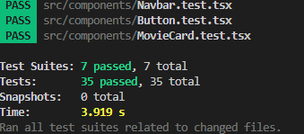
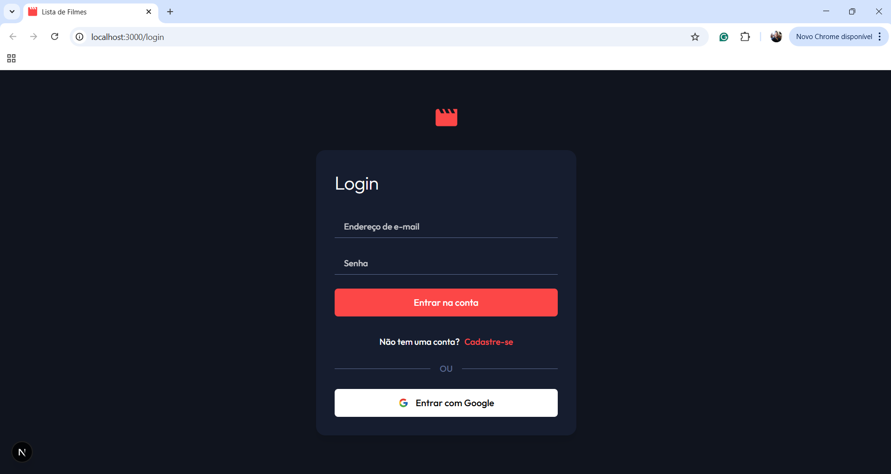
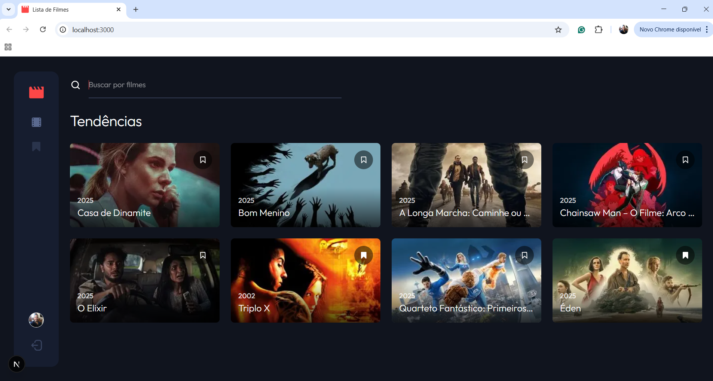
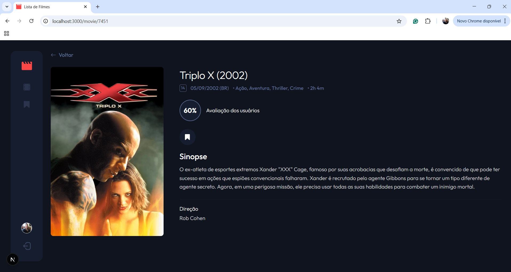
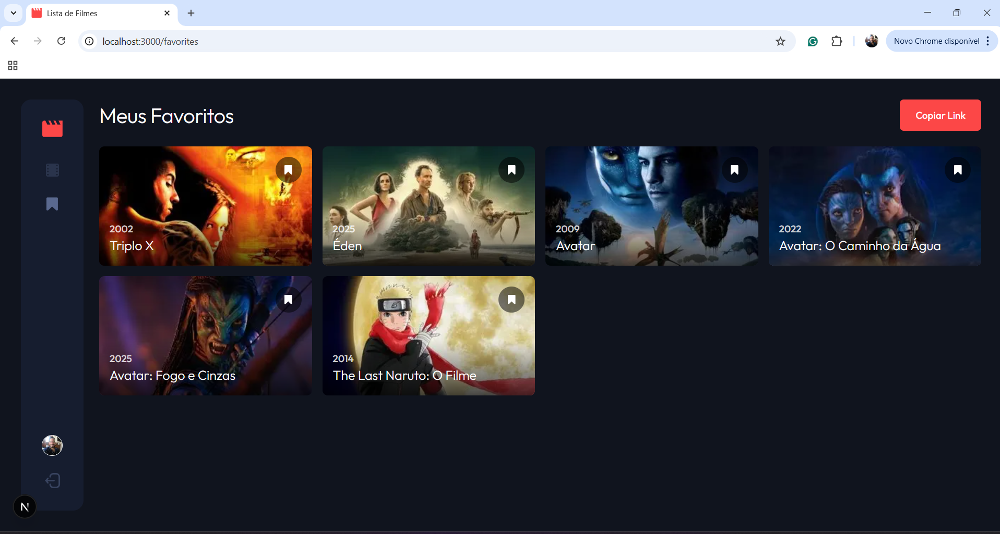
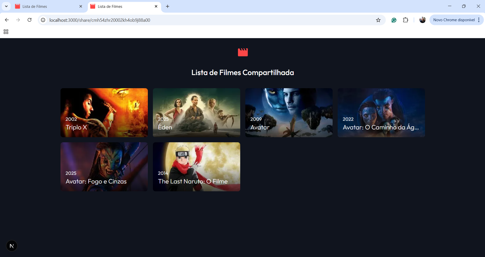

# Front-end - Lista de Filmes (Desafio)

Este é o front-end da aplicação Lista de Filmes, desenvolvido como parte de um desafio. A aplicação permite aos usuários pesquisar filmes, gerenciar uma lista de favoritos, compartilhar essa lista e ver detalhes dos filmes, utilizando a API do The Movie Database (TMDb) através de um back-end dedicado.

Link para o deploy: https://frontend-taupe-one-95.vercel.app/

## Funcionalidades

- Autenticação de usuários (Login/Cadastro com E-mail e Senha, Login com Google) via Firebase Authentication.

- Navegação protegida por autenticação.

- Exibição de filmes em alta.

- Busca de filmes.

- Visualização de detalhes de filmes (incluindo nota, sinopse, classificação, etc.).

- Adicionar/Remover filmes da lista de favoritos.

- Exibição da lista de filmes favoritos do usuário.

- Compartilhamento da lista de favoritos através de um link público.

- Interface responsiva (Mobile, Tablet, Desktop).

## Tecnologias Principais

- Framework: Next.js (React)

- Linguagem: TypeScript

- UI Library: React (v18+)

- Estilização: Tailwind CSS (v4)

- Autenticação: Firebase Authentication (Client SDK)

- Gerenciamento de Estado Global: React Context API (AuthContext, useAuth)

- Busca de Dados (Client-Side): SWR (para caching e revalidação de dados da API)

- Cliente HTTP: Axios (para fazer chamadas à API do back-end)

- Utilitários de Classe: class-variance-authority, clsx, tailwind-merge (para componentização com variantes no Tailwind)

- Testes: Jest & React Testing Library

- Deploy: Vercel

## Estrutura do Projeto

O projeto utiliza o App Router do Next.js e segue uma estrutura organizada por funcionalidade e tipo:
```bash
/frontend
├── .next/
├── node_modules/
│
├── public/                 # Arquivos estáticos (SVGs, imagens)
│   ├── logo.svg
│   ├── google-icon.svg
│   ├── avatar.svg
│   └── ... (outros ícones svg)
│
├── src/
│   ├── app/                # App Router: Rotas e Páginas
│   │   ├── (app)/          # Grupo de Rotas Protegidas (requer login)
│   │   │   ├── layout.tsx    # Layout com Navbar fixa
│   │   │   ├── page.tsx      # Página Home (Trending/Busca)
│   │   │   ├── favorites/
│   │   │   │   └── page.tsx  # Página de Favoritos
│   │   │   └── movie/
│   │   │       └── [movieId]/
│   │   │           └── page.tsx # Página de Detalhes do Filme
│   │   │
│   │   ├── (auth)/         # Grupo de Rotas de Autenticação
│   │   │   ├── layout.tsx    # Layout simples para Login/Cadastro
│   │   │   └── login/
│   │   │       └── page.tsx  # Página de Login/Cadastro
│   │   │
│   │   ├── share/          # Grupo de Rotas Públicas
│   │   │   ├── layout.tsx    # Layout simples para Compartilhamento
│   │   │   └── [shareId]/
│   │   │       └── page.tsx  # Página que exibe a lista compartilhada
│   │   │
│   │   ├── layout.tsx      # Layout Raiz (inclui AuthProvider)
│   │   ├── AuthRedirector.tsx # Componente para redirecionamento inicial
│   │   ├── globals.css     # Estilos globais e configuração do Tailwind via @theme
│   │   └── icon.svg        # Favicon da aplicação
│   │
│   ├── components/         # Componentes React reutilizáveis
│   │   ├── Navbar.tsx
│   │   ├── MovieCard.tsx
│   │   └── ... (outros componentes)
│   │
│   ├── contexts/           # Contextos React para estado global
│   │   └── AuthContext.tsx # Gerencia estado de autenticação e funções de login/logout/sync
│   │
│   ├── hooks/              # Hooks customizados
│   │   └── useFavorites.ts # Lógica para buscar e gerenciar favoritos (adicionar/remover)
│   │
│   ├── lib/                # Configuração de bibliotecas e utilitários
│   │   ├── firebase.ts     # Inicialização do Firebase Client SDK
│   │   └── utils.ts        # Funções utilitárias (ex: cn para classnames)
│   │
│   ├── services/           # Configuração para chamadas de API
│   │   └── api.ts          # Instância do Axios com baseURL e interceptor de token
│   │
│   └── types/              # Definições de tipos TypeScript
│       └── tmdb.ts         # Tipos para Movie, Responses, etc.
│
├── .env.local              # Variáveis de ambiente locais (Firebase Client, API URL) - NÃO VERSIONAR
├── .gitignore
├── next-env.d.ts
├── package-lock.json
├── package.json            # Dependências e scripts do projeto
├── postcss.config.mjs      # Configuração do PostCSS (se necessário para Tailwind v4)
├── README.md               # Este arquivo
└── tsconfig.json           # Configuração do compilador TypeScript
```


## Configuração Local

Clone o repositório: (Se aplicável)
```bash
git clone <url-do-repositorio-frontend>
cd frontend
```

Instale as dependências:
```bash
npm install
```

Configure as Variáveis de Ambiente:

Crie um arquivo .env.local na raiz do projeto.

Adicione as seguintes variáveis, substituindo pelos seus valores:

```bash
# Configuração do Firebase Client SDK (encontrada no Console do Firebase > Configurações do Projeto > Seus apps > App da Web)
NEXT_PUBLIC_FIREBASE_API_KEY="SUA_API_KEY"
NEXT_PUBLIC_FIREBASE_AUTH_DOMAIN="SEU_AUTH_DOMAIN.firebaseapp.com"
NEXT_PUBLIC_FIREBASE_PROJECT_ID="SEU_PROJECT_ID"
NEXT_PUBLIC_FIREBASE_STORAGE_BUCKET="SEU_STORAGE_BUCKET.appspot.com"
NEXT_PUBLIC_FIREBASE_MESSAGING_SENDER_ID="SEU_SENDER_ID"
NEXT_PUBLIC_FIREBASE_APP_ID="SEU_APP_ID"
NEXT_PUBLIC_FIREBASE_MEASUREMENT_ID="SEU_MEASUREMENT_ID" # Opcional

# URL base da sua API Back-end (local ou Vercel)
NEXT_PUBLIC_API_BASE_URL="URL_DA_SUA_API_BACKEND"
```

Importante: Variáveis de ambiente no Next.js que precisam ser expostas ao navegador devem começar com NEXT_PUBLIC_.

Execute o Back-end: Certifique-se de que a API back-end esteja rodando (localmente ou na Vercel) e que a NEXT_PUBLIC_API_BASE_URL esteja apontando para ela.

Inicie o Servidor de Desenvolvimento:
```bash
npm run dev
```

A aplicação estará disponível em http://localhost:3001 (ou a porta indicada no terminal).

## Testes Unitários

O projeto inclui testes unitários básicos para garantir a qualidade e o comportamento esperado dos componentes e funções utilitárias.

### Ferramentas Utilizadas:

- Jest: Framework de testes JavaScript.

- React Testing Library: Biblioteca para testar componentes React focando no comportamento do usuário.

- ts-jest: Para executar testes escritos em TypeScript.

- jest-environment-jsdom: Para simular um ambiente de navegador (DOM).

### Componentes Testados:

- Componente Icon (src/components/ui/Icon.test.tsx)

- Componente Button (src/components/ui/Button.test.tsx)

- Componente SearchBar (src/components/SearchBar.test.tsx)

- Componente MovieCard (src/components/MovieCard.test.tsx)

- Componente Navbar (src/components/Navbar.test.tsx)

- Componente AuthRedirector (src/app/AuthRedirector.test.tsx)

### Como Executar os Testes:
```bash
npm test
```

Este comando executará o Jest em modo "watch", re-executando os testes automaticamente ao salvar arquivos.

### Cobertura de Testes:


## Scripts Disponíveis

npm run dev: Inicia o servidor de desenvolvimento com hot-reloading.

npm run build: Cria a build otimizada para produção.

npm run start: Inicia o servidor em modo de produção (requer npm run build antes).

## Telas da Aplicação

### Login / Cadastro



### Home (Tendências / Busca)



### Detalhes do Filme



### Favoritos



### Lista Compartilhada



## Deploy

O projeto está configurado para deploy na Vercel. É necessário configurar as mesmas Variáveis de Ambiente (NEXT_PUBLIC_...) nas configurações do projeto na Vercel.